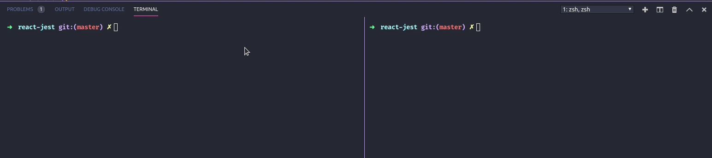

# React-test

> Testes com JEST & ENZYME ;P.



## Installation

OS X & Linux:

```sh
yarn install && yarn start
```

## Run

```sh
yarn test
```

```sh
yarn test -- coverage
```

## Packages installed

```sh
yarn add enzyme enzyme-adapter-react-16 enzyme-to-json
```
